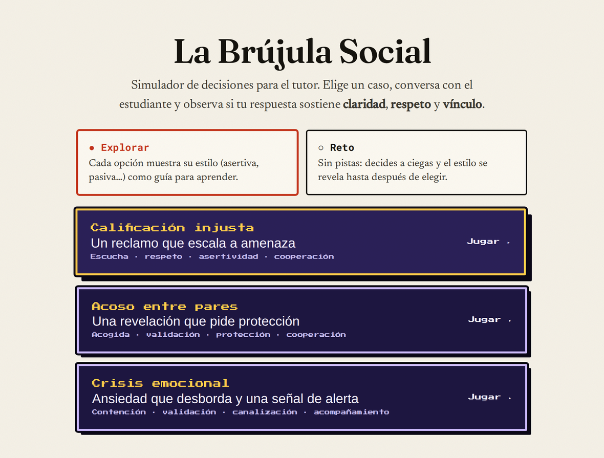
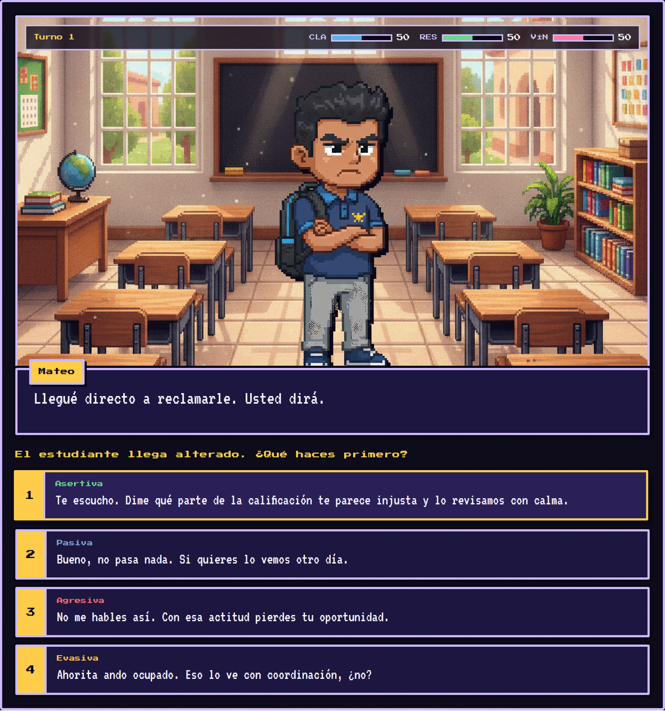
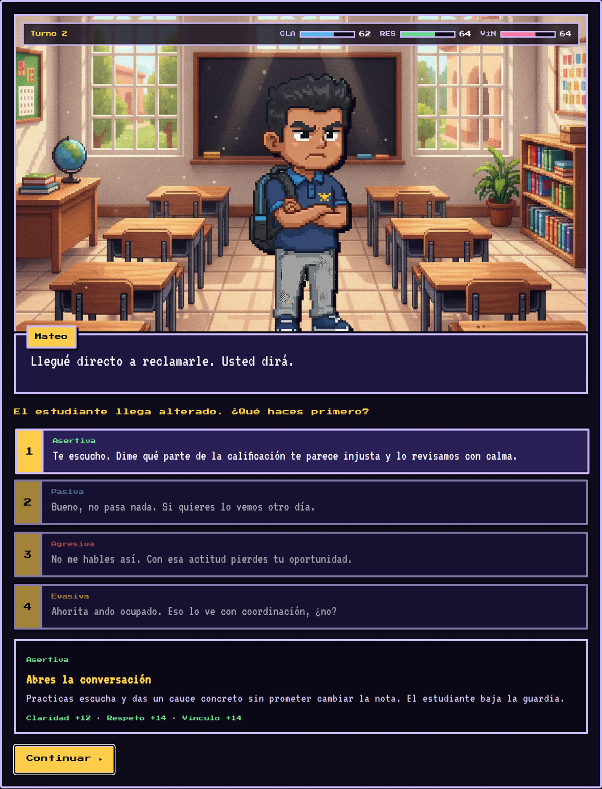
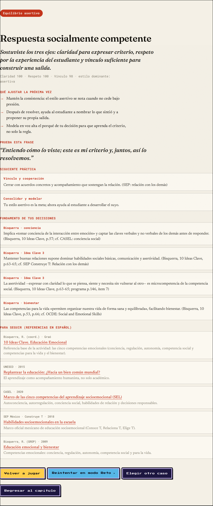

# La Brújula Social — Material de apoyo para la explicación

> Guía rápida para presentar y usar la actividad **La Brújula Social** en clase.
> Simulador en línea, gratuito y sin instalación.
>
> **Enlace:** <https://hesusg.github.io/ser-tutor/brujula-social.html>

---

## ¿Qué es?

**La Brújula Social** es un simulador tipo videojuego para practicar las
competencias socioemocionales del tutor: **escucha, respeto, asertividad y
solución de conflictos**. El participante asume el papel de tutor o tutora y
responde a un estudiante en una situación difícil. Cada decisión tiene
consecuencias, igual que en la vida real.

Se juega desde el navegador, sin crear cuenta y sin instalar nada. Funciona en
computadora, tablet o celular.

---

## ¿Qué se practica? Los tres medidores

Cada respuesta que eliges mueve tres barras, que empiezan en 50:

| Medidor | Qué mide |
|---------|----------|
| **Claridad (CLA)** | Qué tan claro y directo eres al comunicar. |
| **Respeto (RES)** | Si cuidas la dignidad y los derechos del estudiante. |
| **Vínculo (VÍN)** | Si la relación se fortalece o se rompe. |

La meta no es “ganar”, sino **sostener los tres al mismo tiempo**. Una respuesta
puede ser muy clara pero poco respetuosa, o muy amable pero confusa: el reto es
el equilibrio.

---

## Cómo se usa (paso a paso)

### 1. Elige un caso y un modo

Al abrir el enlace verás tres casos y dos modos de juego. Elige uno de cada uno y
presiona **Jugar**.

### 2. Lee al estudiante y elige cómo responder

Aparece la escena. El estudiante dice algo y tú eliges entre cuatro respuestas.
Cada una tiene un **estilo**: *Asertiva, Pasiva, Agresiva* o *Evasiva*.

### 3. Observa el efecto

En cuanto eliges, los tres medidores suben o bajan y aparece una explicación
breve de lo que pasó. Así ves, al momento, el efecto de tu estilo de respuesta.

### 4. Llega al cierre formativo

Al terminar el caso recibes un **perfil**: tu estilo dominante, qué ajustar la
próxima vez, una **frase modelo** y el **fundamento teórico** de tus decisiones,
con sus referencias.

---

## Los tres casos

| Caso | Situación | Microcompetencias que entrena |
|------|-----------|-------------------------------|
| **Calificación injusta** | Un reclamo que escala a amenaza. | Escucha · respeto · asertividad · cooperación |
| **Acoso entre pares** | Una revelación que pide protección. | Acogida · validación · protección · cooperación |
| **Crisis emocional** | Ansiedad que desborda y una señal de alerta. | Contención · validación · canalización · acompañamiento |

## Los dos modos

- **Explorar:** cada opción muestra su estilo *antes* de elegir. Ideal para aprender.
- **Reto:** sin pistas; el estilo se revela *después* de elegir. Ideal para autoevaluarse.

---

## Para explicarla en clase

1. **Proyéctala y juega una ronda en vivo**, pensando en voz alta tus decisiones.
2. **Pide al grupo que vote** la respuesta antes de hacer clic.
3. Después de cada elección, **lean juntos la retroalimentación** y el cambio en
   los medidores.
4. Cierra con la pregunta clave: **¿qué respuesta sostuvo el vínculo?**

## Requisitos técnicos

- Navegador actualizado (Chrome, Edge, Firefox o Safari) con conexión a internet.
- Funciona en computadora, tablet o celular.
- No requiere cuenta, registro ni instalación.

## Fundamento

La actividad está basada en el modelo de educación emocional de **Bisquerra
(2020)**, el marco **CASEL (2020)** y **SEP–Construye T (2018)**. El sustento
teórico de cada decisión aparece dentro del propio cierre de cada caso.

---

*Material de apoyo · Actividad “La Brújula Social” · Proyecto Ser tutor*
